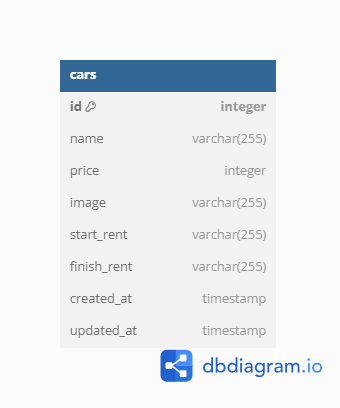

# Challenge 5
## Install
    npm install
## Migrations
    npm run migrate:latest
## Seed
    npm run seed:run cars
## Run
    npm run dev

# REST API
## Get list of Cars
### Request
`GET /cars/`
    
    curl -i -H 'Accept: application/json' http://localhost:3000/cars

### Response
    HTTP/1.1 200 OK
    X-Powered-By: Express
    Content-Type: application/json; charset=utf-8
    Content-Length: 850
    ETag: W/"352-bLBfuhUm+HRYZDaYojKWmB4Yi1M"
    Date: Sun, 19 May 2024 08:32:26 GMT
    Connection: keep-alive
    Keep-Alive: timeout=5

    {"message":"OK","cars":[{"id":1,"name":"Toyota Camry","price":430000,"image":"https://res.cloudinary.com/daoqz3rdr/image/upload/v1715969479/Toyota_Camry_ubrxzx.webp","start_rent":"2024-05-01","finish_rent":"2024-05-10","created_at":"2024-05-19T08:28:36.077Z","updated_at":"2024-05-19T08:28:36.077Z"},{"id":2,"name":"Honda Civic","price":430000,"image":"https://res.cloudinary.com/daoqz3rdr/image/upload/v1715969551/Honda_Civic_zynbax.jpg","start_rent":"2024-05-05","finish_rent":"2024-05-15","created_at":"2024-05-19T08:28:36.077Z","updated_at":"2024-05-19T08:28:36.077Z"},{"id":3,"name":"Ford Mustang","price":430000,"image":"https://res.cloudinary.com/daoqz3rdr/image/upload/v1715969609/Ford_Mustang_u4lsov.webp","start_rent":"2024-05-10","finish_rent":"2024-05-20","created_at":"2024-05-19T08:28:36.077Z","updated_at":"2024-05-19T08:28:36.077Z"}]}

## Create a new Car

### Request

`POST /cars/create`

    curl -i -H "Accept: application/json" -X POST -F "image=@C:/Users/User/Downloads/Honda Civic.jpeg" -F "name=Hyundai" -F "price=200000" -F "start_rent=2024/04/02" -F "finish_rent=2024/05/18" http://localhost:3000/cars/create

### Response
    HTTP/1.1 201 Created
    X-Powered-By: Express
    Content-Type: application/json; charset=utf-8
    Content-Length: 332
    ETag: W/"14c-6JwBHo7bSrD92v487JwYRbUeUqQ"
    Date: Sun, 19 May 2024 08:37:46 GMT
    Connection: keep-alive
    Keep-Alive: timeout=5

    {"status":"OK","message":"Data Berhasil Disimpan!","car":{"name":"Hyundai","price":200000,"image":"http://res.cloudinary.com/daoqz3rdr/image/upload/v1716107865/bcr/mzecfixtn2lrdvipicwy.jpg","start_rent":"2024/04/02","finish_rent":"2024/05/18","id":18,"created_at":"2024-05-19T08:37:46.547Z","updated_at":"2024-05-19T08:37:46.547Z"}}

## Change a specific Car

### Request

`PUT /cars/:id`

    curl -i -H "Accept: application/json" -X PUT -F "image=/@C:/Users/User/Downloads/Toyota Camry.webp" -F "name=Toyota" http://localhost:3000/cars/2

### Response
   
    HTTP/1.1 200 OK
    X-Powered-By: Express
    Content-Type: application/json; charset=utf-8
    Content-Length: 51
    ETag: W/"33-jIA+Ij8C5LYmuwpdleot5O6BURw"
    Date: Sun, 19 May 2024 08:40:28 GMT
    Connection: keep-alive
    Keep-Alive: timeout=5

    {"status":"OK","message":"Data berhasil Diupdate!"}

## Delete a specific car

### Request

`DELETE /cars/:id`

    curl -i -H 'Accept: application/json' -X DELETE http://localhost:3000/cars/2

### Response
    HTTP/1.1 200 OK
    X-Powered-By: Express
    Content-Type: application/json; charset=utf-8
    Content-Length: 50
    ETag: W/"32-YP67BQlW0GfnXvX3e9whDNdS700"
    Date: Sun, 19 May 2024 08:42:37 GMT
    Connection: keep-alive
    Keep-Alive: timeout=5

    {"status":"OK","message":"Data berhasil Dihapus!"}

# ERD (Entity Relationship Diagram)

